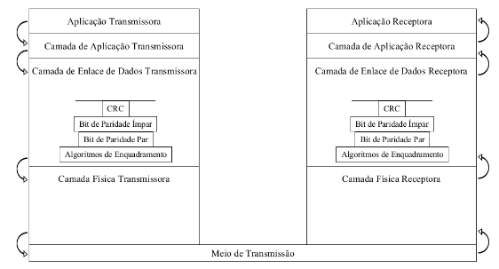
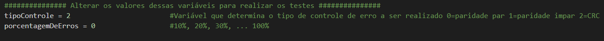

# SSC0641
Trabalho final da disciplina SSC0641 - Redes de Computadores, ministrada pelo Instituto de Ciências Matemáticas e de Computação da Universidade de São Paulo. Trata-se de um simulador da camada de enlace.

Integrantes do grupo:
- Beatriz Rocha,    NUSP: 11300051
- Érika Cardoso,    NUSP: 10696830
- Juliana Freitas,  NUSP: 11317928
- Juliana Eusébio,  NUSP: 10693340

## Como compilar o código
O projeto foi desenvolvido utilizando o WSL com o ubuntu 20.04.2 LTS.

Em seguida utilize o seguinte comando no terminal linux:

```
python3 simulador.p
```

## A aplicação
A aplicação reproduz o fluxo abaixo:



São implementados três métodos de detecção de erros:
- Bit de paridade par
- Bit de paridade impar
- CRC

Para selecionar um deles, altere o valor da variável ```tipoControle``` da seguinte forma:
- 0 => para controle de paridade par
- 1 => para controle de paridade ímpar
- 2 => para cyclic redundancy check



O percentual de erro também pode ser controlado ao se alterar o valor da variável ```porcentagemDeErros``` (sendo que o valor 0 garante ausência de erros e o valor 100 assegura que ocorrerá erro)